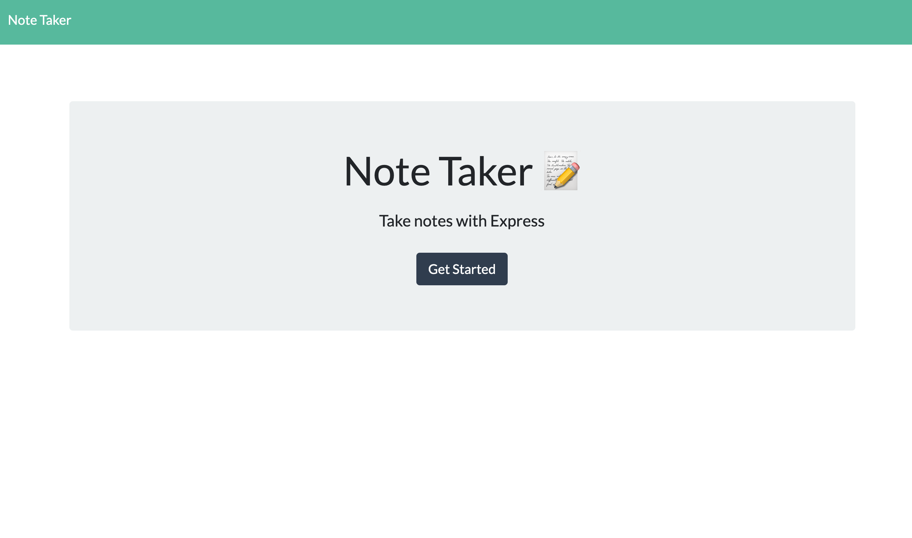
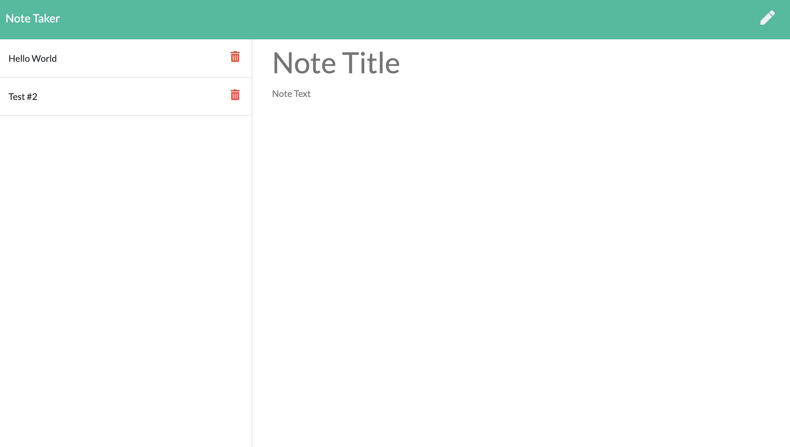

# Note-Taker

A note taking application that allows users to create, save, and delete notes all in one place. Once a note has been saved, users can easily view their notes with one simple click. Built with Express.js, Node.js, jQuery, JavaScript, HTML, CSS

You can access the deployed application here:
[https://sheltered-shelf-03581.herokuapp.com/](https://sheltered-shelf-03581.herokuapp.com/)

## The Challenge

Create an application that can be used to write, save, and delete notes. This application will use an express backend and save and retrieve note data from a JSON file.

## The Output

Screenshots of the completed application are below:

**Main Page**


**Notepad**


## Installation

Clone the repo:
```
git clone https://github.com/hromero7/note-taker.git
```

Install NPM Packages
```
npm install
```

The project was uploaded to [GitHub](https://github.com/) at the following repository:
[https://github.com/hromero7/note-taker](https://github.com/hromero7/note-taker)
